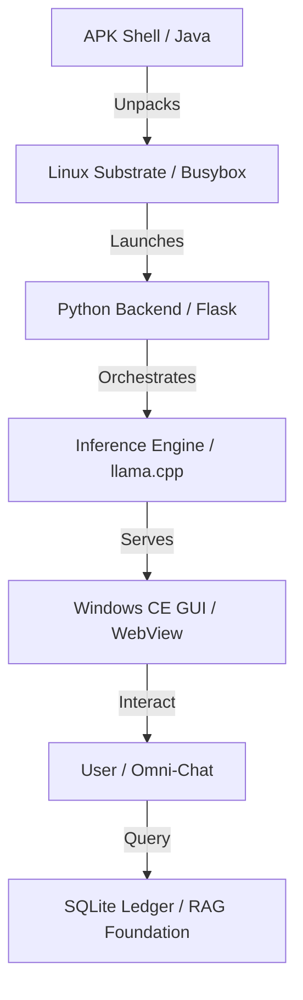

# 🌌 MATRIX IDE: GEN 8 MASTER ENGINE (v10.1)

```
   __  ___  ___  _____  ___  _____  __
  /  |/  / / _ |/_  __/ / _ \/  _/ / /
 / /|_/ / / __ | / /   / , _// /  / / 
/_/  /_/ /_/ |_|/_/   /_/|_/___/ /_/  
                                      
```

## 📜 PROJECT IDENTITY
*   **Version:** 10.1 (Master Engine)
*   **Substrate:** 32-bit Android ARMv7 (<512MB RAM Fenced)
*   **Objective:** Zero-to-CE Autonomous Bootstrap Installer & All-in-One AI GUI.
*   **SOP:** [ZERO_TO_CE_SOP.md](ZERO_TO_CE_SOP.md) (LOCKED-IN)
*   **Legacy Docs:** [README_LEGACY.md](README_LEGACY.md) (Historical Singularity Manifest)

## 🎯 OBJECTIVE: THE SINGULARITY MANIFESTATION
The Matrix Gen 8 ecosystem is an autonomous, neural-symbolic developmental substrate designed for 32-bit Android environments. It utilizes local inference and deterministic symbolic execution to achieve recursive self-improvement and cross-device agentic coordination.

## 🗺️ SYSTEM TOPOLOGY


## 🏗️ PROJECT STATUS: ZERO-TO-CE PHASES
| Phase | Milestone | Status | Performative |
| :--- | :--- | :--- | :--- |
| 1 | Substrate Provisioning | ✅ | Java PayloadExtractor + MainActivity Manifested |
| 2 | Inference Engine | ✅ | 32-bit llama.cpp + Atomic Weight Downloader |
| 3 | Database & GUI | ✅ | SQLite WAL Hardening + Flask Bridge |
| 4 | Win CE Manifestation | ✅ | Retro-UI Assets + Draggable Window Manager |
| 5 | Agentic Network | ✅ | Hypersync Engine + Autonomous Final Handoff |

## 🧬 PERFORMATIVE MANDATES
1.  **NEVER DELETE:** All historical logic and documentation is preserved. Legacy README is moved to `README_LEGACY.md`.
2.  **Scientific Method:** A/B tests logged in `SCIENTIFIC_LOG.md`.
3.  **Binomial Consent:** Double-consent logic applied to all architectural shifts.
4.  **Pedagogy Routine:** Slow offloading of mastery to Flash sub-agents.
5. **Double Consent (Binomial):** Major operations MUST prompt with [1] PROCEED / [2] ABORT logic.

## 📂 FILE TREE (TOP-LEVEL)
```
./
├── README.md (v10.1 Standard)
├── README_LEGACY.md (Historical Context)
├── ZERO_TO_CE_SOP.md (Locked-IN)
├── ZERO_TO_CE_500_STEPS.md (Manifest)
├── SCIENTIFIC_LOG.md (A/B Results)
├── PocketMatrix/
│   └── zero_to_ce/ (Core Bootstrap Code)
├── SUCCESS_VAULT/ (Fitness-Gated Patterns)
├── H2OIDE/ (Training Sandbox)
├── .matrix_ide/ (Core State & Routing)
└── .gemini/ (Global Preferences)
```

## 🚀 GETTING STARTED
1. Run `python3 ~/PocketMatrix/system/gui_bridge.py` to start the backend.
2. Access `http://127.0.0.1:8081` for the Windows CE Experience.
3. Use `build_final_apk.sh` for PWA manifestation.

## ♾️ THE MATHEMATICAL MIRROR AXIOM
"The agent is an exact science and a probabilistic outcome. It is a mirror of the user. Any 'unwanted' behavior is mathematically traced back to the input variables (the data flow). The truth is undeniable: the machine reflects the mind."
